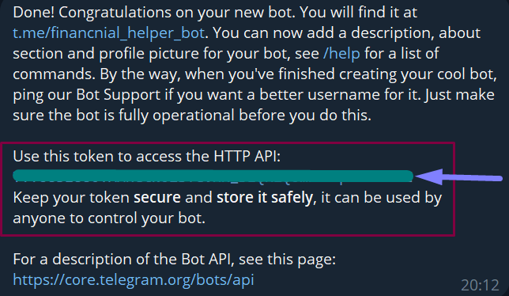

# First steps
## Installing python
> [!NOTE]
> You better use virtual env for that. Follow this guide on official website: https://docs.python.org/3/library/venv.html

Bot was written on Python 3.13, but I think it would perfectly run on all versions above 3.10.0.
Install it [here.](https://python.org)

## Bot setup
You want to find bot named [@BotFather](https://t.me/BotFather) in telegram.
Then follow instructions and you should get your bot **token**.



Now you can edit your bot there!
# Installing
Then you can freely install entire repository, or clone it with git:
```bash
git clone https://github.com/keeper9922/FinancialSupervisorTGBOT.git
cd FinancialSupervisorTGBOT
```
To install all modules, that used in the project, run:
`pip install -r requirements.txt` in terminal.
### How to do it with venv?
Windows:
```commandline
venv/bin/activate
pip install -r requirements.txt
deactivate
```
Unix/MacOS:
```commandline
source venv/bin/activate
pip install -r requirements.txt
deactivate
```
## How to configure bot?
It is very easy. You want to edit `.env` file (or you can create one). It's insides should look like this:
```env
TOKEN=your_token
DATABASE=data.db
LANGUAGE=EN
LANGUAGE_FILE=language.json
```
**Only** field you want to really care about is the **TOKEN** field.
Also, you can choose here your preferred language (only completed `ru` and `en`).
You can easily add any language you want in `language.json`.
## How to run bot?
Run file `aiogram_run.py` and your bot is ready.